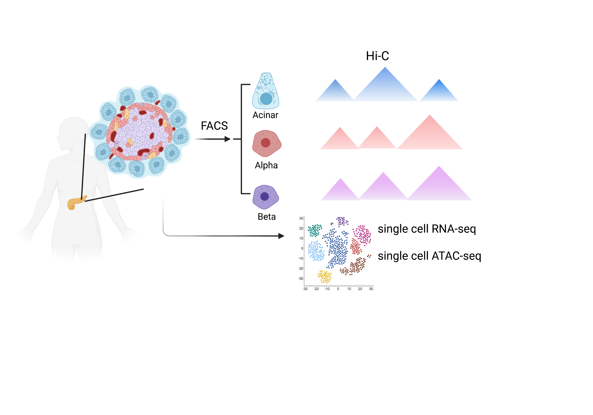

# pancreasHiC

## Hi-C
- [preprocess was performed for each sample](./hic/hic_preprocess.sh)
  - [hicup v0.7.9](https://www.bioinformatics.babraham.ac.uk/projects/hicup/read_the_docs/html/index.html)
  - bam to pairs and pre format with [pairtools v0.3.0](https://github.com/open2c/pairtools)
  - pairs to `.hic` and `.cool` matrix with [cooler v0.8.3](https://github.com/open2c/cooler)

- [identifying AB compartments, TADs and loops for each cell type](./hic/identify_ab_tad_loop.sh)
  - AB compartment at 40kb resolution (`cooltools call-compartments`)
  - TADs at 10kb resolution ([hitad v0.4.2-r1](https://xiaotaowang.github.io/TADLib/hitad.html))
  - loops ([mustache 2020/10/13](https://github.com/ay-lab/mustache) pt < 0.1 + [Fit-Hi-C v2.0.7](https://ay-lab.github.io/fithic/) fdr < 1e-6) at 1K, 2K and 4K resolution.

- loop and AB differential analysis
  - Quantitative loop differential was performed by [multiCompareHiC v1.8.0](https://www.bioconductor.org/packages/devel/bioc/vignettes/multiHiCcompare/inst/doc/multiHiCcompare.html) for each chromosome and correct with fdr after merging all chromosomes. The global differential loops further overlap with consensus loops merged cross cell types
  - AB compartment is based on the PC1 and compared across cell types.

## single cell RNA-seq

- single cell RNA-seq was preprocessed with [cellRanger v](https://support.10xgenomics.com/single-cell-gene-expression/software/pipelines/latest/choosing-how-to-run) and analyzed with [Seurat](https://satijalab.org/seurat/articles/pbmc3k_tutorial.html)

- deconvulution was performed using [MuSiC v0.1.1](https://github.com/xuranw/MuSiC)

## single cell ATAC-seq

- single cell RNA-seq was preprocessed with [snapTools v](https://github.com/r3fang/SnapTools) and analyzed with [snapATAC v1.0.0](https://github.com/r3fang/SnapATAC)

## variant to gene mapping

## integration

- featureEnrichment